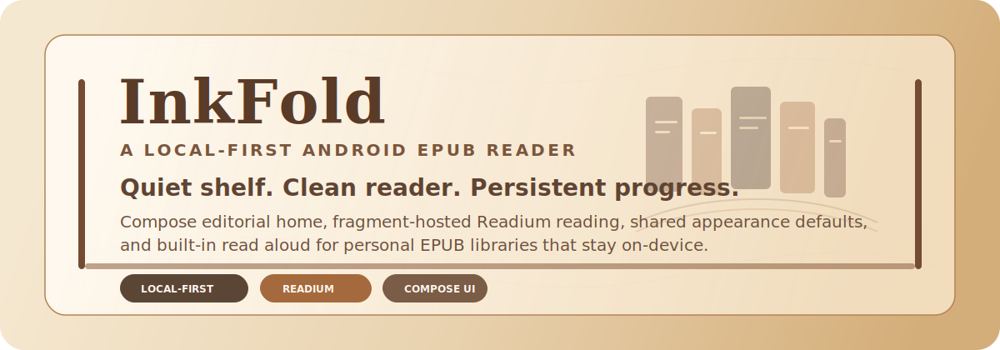
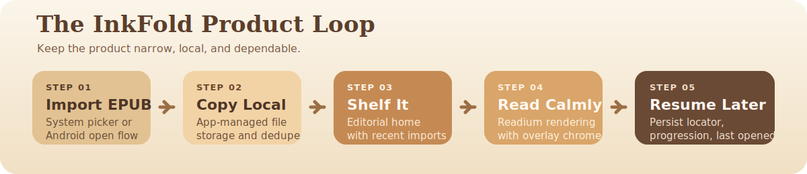

<p align="center">
  
</p>

<p align="center">
  <a href="#current-status"></a>
  
  
  
  
</p>

<p align="center">
  <strong>InkFold</strong> is a local-first Android EPUB reader that treats personal bookshelves like bookshelves, not storefronts.
  It combines a Compose-built editorial home experience with a fragment-hosted Readium reader, persistent progress, curated palettes,
  shared appearance defaults, and built-in read-aloud support.
</p>

<p align="center">
  
</p>

## Overview

InkFold is intentionally narrow in scope. The app is optimized around one calm, reliable loop:

1. Import an EPUB from the system picker or Android's `Open with` flow.
2. Copy it into app-managed storage.
3. Surface it on a warm shelf-style home screen.
4. Open it in a Readium-powered reader with Compose overlay chrome.
5. Save progression and resume from the last meaningful locator.

That constraint is the product. InkFold is not trying to be a cloud library, storefront, sync service, or multi-format media hub.

## Reading Loop

<p align="center">
  
</p>

## Why It Feels Different

| Editorial Shelf | Reader That Stays Out Of The Way |
| --- | --- |
| Adaptive lazy shelf grid with tall `2:3` covers, serif-forward typography, and a prominent continue-reading treatment. | Fragment-hosted Readium EPUB rendering with hideable Compose chrome so controls do not permanently consume reading space. |
| Recent imports row and explicit per-book actions keep library management visible without turning the home screen into a dashboard. | Bottom progress chrome keeps navigation compact, progression-based, and resilient to pagination changes caused by theme, fonts, or margins. |

| Local Ownership | Accessibility And Comfort |
| --- | --- |
| Every accepted EPUB is copied into app storage immediately. Library access does not depend on long-lived SAF permissions. | Shared EPUB defaults support theme, paged vs scroll mode, bounded font sizing, typeface, dark-image filters, and discrete page margins. |
| Imports are deduplicated by SHA-256 content hash and progress is persisted in Room. | Readium TTS powers read aloud with spoken-text highlight, follow-along sync, and separate speed, pitch, language, and voice preferences. |

## Feature Snapshot

| Area | What Ships Today |
| --- | --- |
| Import | In-app `OpenDocument` EPUB import and Android external `VIEW` / `SEND` EPUB handling via `ImportActivity`. |
| Library | App-managed EPUB copies, separate extracted covers, SHA-256 dedupe, explicit remove actions, recent imports row, and continue-reading prominence. |
| Reader | Hybrid architecture with Compose overlay chrome and `EpubNavigatorFragment` rendering. |
| Navigation | Resume from last locator, quick-jump progression slider, and Contents / Pages / Landmarks sheets when available. |
| Appearance | Eight persisted Material 3-derived InkFold palettes plus shared EPUB appearance defaults stored through DataStore-backed Readium preferences. |
| Read Aloud | Readium TTS integration with compact controls, highlight, follow-along throttling, and recovery prompts for missing voice data. |
| Persistence | Room-backed book metadata and reading progression, plus separate DataStore stores for app theme and reader/TTS preferences. |

## Architecture

```text
app/src/main/java/com/shubhamghanmode/inkfold/
  AppContainer.kt
  InkFoldApplication.kt
  ReadiumServices.kt
  data/book/
  feature/home/
  feature/importer/
  feature/reader/
  feature/reader/outline/
  feature/reader/preferences/
  feature/reader/tts/
  ui/theme/
```

### Key Decisions

- The dependency graph stays manual in `AppContainer`; this repo does not use Hilt.
- Readium wiring is intentionally contained within `ReadiumServices`, `ReadiumPublicationInspector`, and `feature/reader/`.
- The reader stays hybrid: Compose owns app chrome and settings, while Readium keeps actual EPUB rendering fragment-based.
- Reader appearance defaults and TTS preferences are persisted separately.
- Page-flip classes exist only as scaffolding; no interactive page-flip feature ships on this branch.

## Tech Stack

| Layer | Implementation |
| --- | --- |
| App platform | Android app module in Kotlin, minSdk `31`, targetSdk `36` |
| UI | Jetpack Compose Material 3 for shelf, settings, and reader chrome |
| Reading engine | Readium Kotlin Toolkit `3.1.2` |
| Persistence | Room for books and progression, DataStore for appearance/theme/TTS preferences |
| Images | Coil for cover loading |
| Tooling | Gradle Kotlin DSL, version catalog in `gradle/libs.versions.toml`, Room via KSP |

## Setup

### Prerequisites

- Android Studio with the Android SDK for API `36`
- An Android 12+ emulator or physical device for manual reader validation
- A compatible Gradle/Android Studio JDK for AGP `9.1.0`

### Open The Project

```bash
git clone <your-fork-or-this-repo-url>
cd InkFold
./gradlew :app:assembleDebug
```

If you prefer Android Studio:

1. Open the repository root.
2. Let Gradle sync the project.
3. Build or run the `app` configuration.

### Build Notes

- Dependency versions live in `gradle/libs.versions.toml`.
- This branch keeps `android.newDsl=false` and `android.builtInKotlin=false` in `gradle.properties` because of the current AGP / KSP / Readium compatibility setup.
- Core library desugaring is enabled because Readium requires it.
- Debug and release builds are both minified and resource-shrunk.
- APK splits are currently configured for `arm64-v8a`.

## Verification

### Current Status

Verified on `2026-03-29`:

| Check | Result |
| --- | --- |
| `./gradlew :app:assembleDebug` | Pass |
| `./gradlew :app:testDebugUnitTest` | Pass |
| `./gradlew :app:assembleDebugAndroidTest` | Pass |
| `./gradlew :app:lintDebug` | Pass |
| `./gradlew :app:connectedDebugAndroidTest` | Not run - no emulator/device available at verification time |

### Preferred Manual Acceptance

1. Import an EPUB from the in-app picker.
2. Confirm the book appears on the shelf once.
3. Open it, move forward, leave the reader, and reopen it.
4. Confirm resume lands near the saved position.
5. Open the same EPUB from a file manager and confirm InkFold appears in the Android `Open with` sheet.
6. Confirm opening the same file again does not create a duplicate library row.
7. In the reader, change theme, scroll mode, font size, typeface, image filter, and page margins; verify the current page restyles live when applicable.
8. Reopen the same book and confirm appearance settings persist with the resume locator.
9. Use the quick-jump slider and confirm progression remains stable.
10. Open the outline sheet and verify Contents, Pages, and Landmarks only appear when the EPUB exposes them.
11. Start read aloud from the current page and verify transport controls, highlight, follow-along, and TTS settings changes.
12. If device voice data is missing, verify the install-voice recovery path works.
13. Switch among palette presets from the home screen settings and verify the shelf and reader chrome update in both system light and dark mode.

## Scope

| In Scope | Out Of Scope Unless Explicitly Requested |
| --- | --- |
| Local EPUB import | PDF, CBZ, comics, audiobooks |
| Android `Open with` support for EPUB files | Accounts, sync, remote backup, cloud libraries |
| Personal library shelf UI | OPDS browsing inside InkFold |
| Fragment-hosted EPUB reading | DRM / LCP work |
| Progress persistence and resume | Highlights, annotations, search UI, bookstore features |
| Offline reading of imported local books | General-purpose document management |

## Repo Landmarks

| Path | Responsibility |
| --- | --- |
| `app/src/main/java/com/shubhamghanmode/inkfold/feature/home/` | Home shelf, continue-reading presentation, recent imports, and palette settings sheet |
| `app/src/main/java/com/shubhamghanmode/inkfold/feature/importer/` | No-UI trampoline activity for external EPUB intents |
| `app/src/main/java/com/shubhamghanmode/inkfold/feature/reader/` | Reader session prep, navigator configuration, overlay chrome, progression persistence, and page-flip scaffolding |
| `app/src/main/java/com/shubhamghanmode/inkfold/feature/reader/outline/` | TOC / page-list / landmark mapping and UI-safe outline models |
| `app/src/main/java/com/shubhamghanmode/inkfold/feature/reader/preferences/` | Shared EPUB appearance persistence and reader settings UI |
| `app/src/main/java/com/shubhamghanmode/inkfold/feature/reader/tts/` | Read aloud state, controls, TTS preferences, and error handling |
| `app/src/main/java/com/shubhamghanmode/inkfold/data/book/` | Room entities/DAO plus import, deletion, file storage, and progression logic |
| `readium-kotlin-toolkit-3.1.2/test-app/` | Primary reference implementation for Readium integration patterns |

## Roadmap

- Run connected instrumentation tests on a real emulator or device.
- Complete full external file-open acceptance from a file manager.
- Perform on-device validation for reader appearance settings, palette switching, outline navigation, quick-jump flow, and read aloud.
- Decide whether per-book appearance overrides should ship after shared defaults prove stable.
- Decide whether read aloud should expand into background or media-session controls.
- Keep page-flip investigation behind the core reading-loop roadmap.

## Documentation

- [`AGENTS.md`](AGENTS.md) is the project guide for future implementation and architecture changes.
- [`IMPROV.md`](IMPROV.md) tracks the live roadmap and outstanding follow-up.
- `README.md` is the contributor-facing landing page and should stay visually polished as the project evolves.

## License

InkFold is distributed under the [`LICENSE`](LICENSE) file in this repository.
